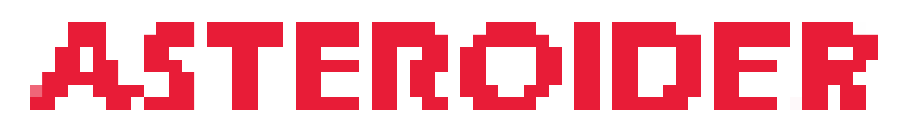
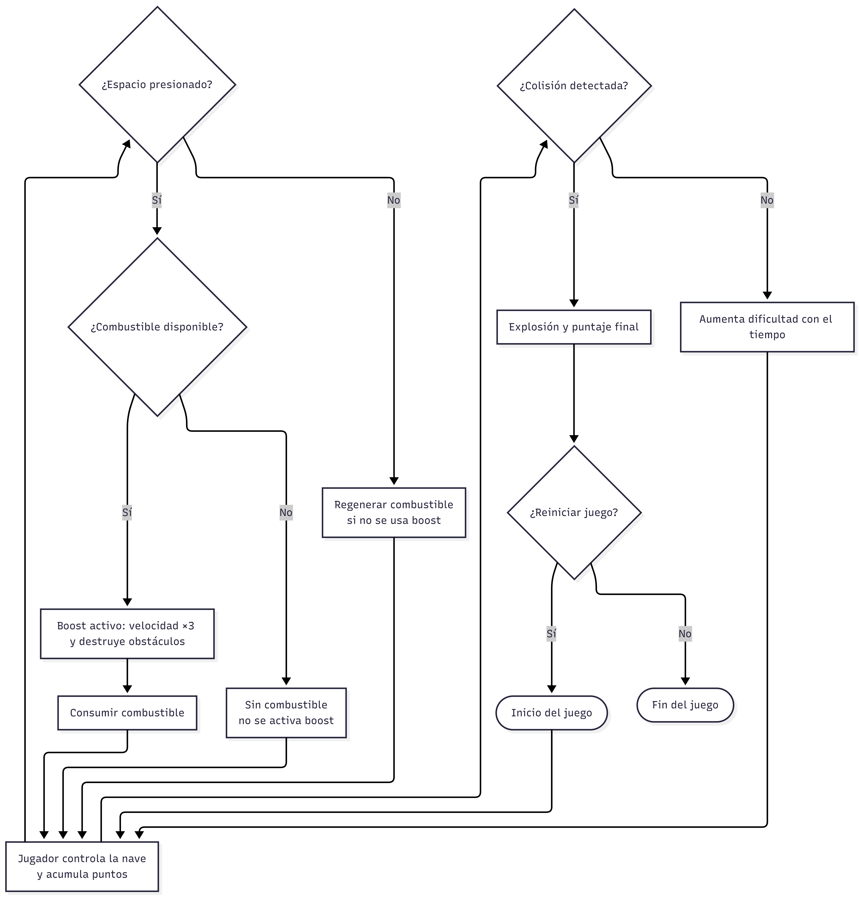
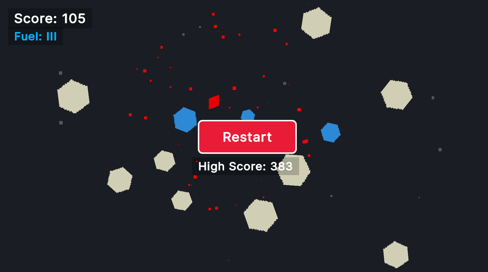
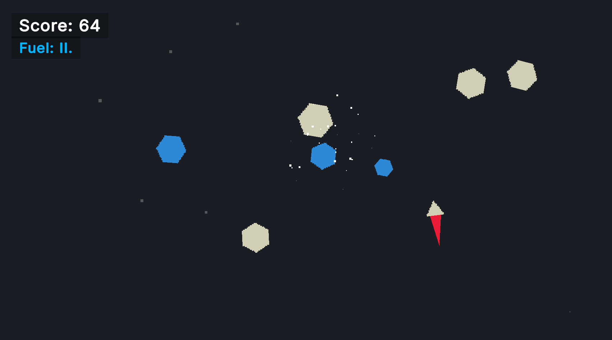
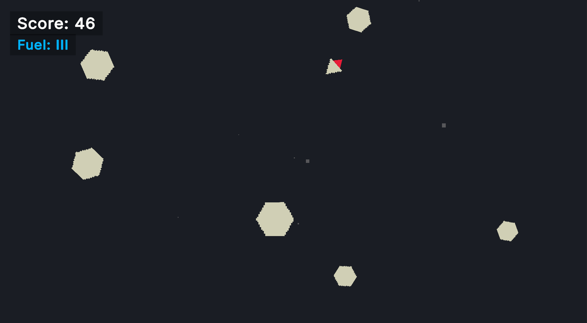

# Asteroider

Juego de supervivencia 2D top-down hecho en Unity. El jugador navega un campo de asteroides, enemigos perseguidores y objetos bonus usando propulsion con el mouse y un boost limitado por combustible.

## Como funciona

- **Movimiento**: Mantener click izquierdo para propulsarse hacia el cursor. La nave rota para mirar al mouse.
- **Boost**: Mantener Espacio para activar boost (3x velocidad + destruye obstaculos/perseguidores al contacto). Limitado por combustible: max 3 barras, 1 barra consumida por segundo de boost, 1 barra regenerada cada 2 segundos sin boostear. El boost solo se activa si hay al menos 1 barra completa disponible.
- **Obstaculos**: Aparecen desde 4 zonas en los bordes, vuelan hacia el centro de la pantalla con dispersion aleatoria. Los obstaculos regulares matan al colisionar (a menos que se este boosteando). Los obstaculos bonus (azules) dan 100 puntos y son seguros.
- **Enemigo Perseguidor**: Enemigo rojo que acelera suavemente hacia el jugador. Atraviesa obstaculos. Mata al contacto (a menos que se este boosteando, en cuyo caso el perseguidor es destruido).
- **Dificultad**: Aumenta cada 5 segundos en 6 niveles (30s hasta el maximo). Escala velocidad de obstaculos, tasa de aparicion y cantidad por oleada.
- **Muerte**: Dispara efecto de particulas de explosion, guarda el puntaje maximo, muestra boton de reinicio con feedback hover/click.
- **Puntaje**: Basado en tiempo (scoreMultiplier x segundos) + recoleccion de bonus.

## Elementos del juego

| Elemento | Descripcion |
|---|---|
| Jugador | Nave triangular, propulsion con mouse, boost con combustible |
| Obstaculo | Asteroide gris, tamano/velocidad aleatorio, mata al contacto |
| Obstaculo Bonus | Asteroide azulado, 100pts, seguro al tocarlo |
| Enemigo Perseguidor | Enemigo rojo, IA de persecucion, collider trigger |
| Llama del Booster | Objeto hijo animado, 2 estados (Normal/Boost) |

## Variables configurables clave

### Player (PlayerControllerScript)
| Campo | Default | Proposito |
|---|---|---|
| thrustForce | 10 | Aceleracion de movimiento |
| maxSpeed | 20 | Velocidad maxima de movimiento |
| scoreMultiplier | 10 | Puntaje = piso(tiempo x multiplicador) |
| bonusObstacleScore | 100 | Puntos por recoger bonus |

### Sistema de Combustible (PlayerFuelSystem)
| Campo | Default | Proposito |
|---|---|---|
| maxFuel | 3 | Barras maximas de combustible |
| fuelRegenRate | 0.5 | Unidades regeneradas por segundo |
| boostSpeedMultiplier | 3 | Multiplicador de velocidad al boostear |

### Dificultad (DifficultyManager)
| Campo | Default | Proposito |
|---|---|---|
| difficultyInterval | 5 | Segundos entre escalones de dificultad |
| maxDifficultyLevel | 6 | Escalones hasta dificultad maxima |

### Spawning (SpawnZoneScript)
| Campo | Default | Proposito |
|---|---|---|
| baseSpawnInterval→spawnInterval | 6→2s | Intervalo de oleadas (inicial→max) |
| baseMinSpawnCount→minSpawnCount | 1→2 | Min obstaculos por oleada |
| baseMaxSpawnCount→maxSpawnCount | 2→5 | Max obstaculos por oleada |
| bonusChance | 0.15 | Probabilidad de obstaculo bonus |
| chaserChance | 0.1 | Probabilidad de perseguidor por oleada |

### Obstaculo (ObstacleScript)
| Campo | Default | Proposito |
|---|---|---|
| baseMinSpeed→minSpeed | 18→50 | Velocidad minima (inicial→max) |
| baseMaxSpeed→maxSpeed | 42→100 | Velocidad maxima (inicial→max) |

### Perseguidor (ChaserEnemy)
| Campo | Default | Proposito |
|---|---|---|
| speed | 15 | Velocidad objetivo de persecucion |
| acceleration | 1 | Factor de suavizado de velocidad |
| rotationSpeed | 2 | Tasa de rotacion hacia el objetivo |

## Screenshots

  
   
  
   
  

